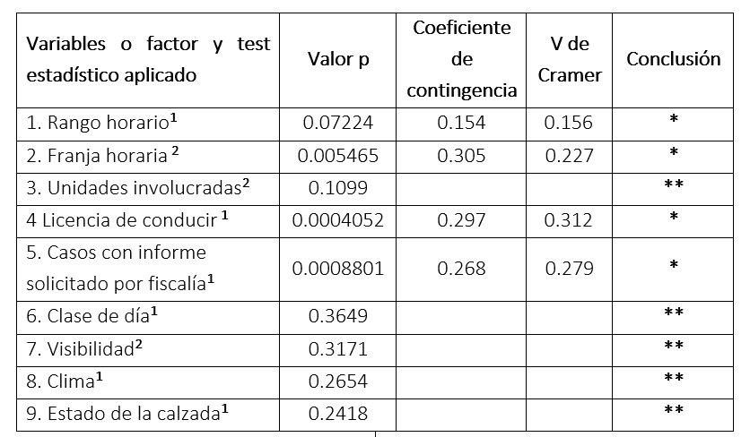

```{r setup, include=FALSE}
options(tinytex.verbose = TRUE)
knitr::opts_chunk$set(echo = FALSE)
library(readxl)
library(dplyr)
library("factoextra")
library("FactoMineR")
library(ggplot2)
library(scales)
library(graphics)
library(corrplot)

if(!require('leaflet')) install.packages('leaflet')
library(leaflet)

library(ggpubr)
```


<style>

.leaflet-tile-container img.leaflet-tile  {
    margin: 0;
    background: none;
    border: none;
    box-shadow: none;
    max-height: inherit;
}

.reveal .leaflet-container {
    font: 12px/1.5 "Helvetica Neue", Arial, Helvetica, sans-serif;
}


.reveal .leaflet-container .leaflet-popup-tip-container {
    margin: 0 auto;
}

.reveal .leaflet-container .leaflet-popup-content-wrapper {
    padding: 1px;
    margin: inherit;
}

.reveal .leaflet-container .leaflet-popup-content {
    margin: 13px 19px;
    line-height: 1.4;
}

.reveal .leaflet-container .leaflet-popup-content h3 {
    color: #333;
}

.reveal .leaflet-container .leaflet-popup-tip {
    padding: 1px;
    margin: -10px auto 0;
}

.reveal .leaflet-container .leaflet-popup-content, .reveal .leaflet-popup-content h2 {
    color: #333;
}

.reveal .leaflet-container .leaflet-popup-content pre {
    font-size: 14px;
    width: 100%;
    box-shadow: none;
}
</style>

```{r, include=FALSE}
datos<- read_excel("Formulario_Tecnico_Excel.xlsx")
accidentologia <- read_excel("accidentologia-20190807-preprocesado.xlsx")
accidentologia <- accidentologia[1:480,]

datos$horaNEW1 <- ifelse(0<=datos$hora & datos$hora<6,"noche",ifelse(6<=datos$hora & datos$hora<=13,"mañana",ifelse(14<=datos$hora & datos$hora<=21,"tarde","noche")))
datos$clasebinaria <- ifelse(datos$tipo_lesion=="Lesiones leves" | datos$tipo_lesion=="Sin lesiones", "Leve", "Grave")
```

# Motivación

* Costos humanos, materiales, psicológicos
* Pérdidas personales, familiares, como sociedad
* Agencia Nacional de Seguridad Vial adhirió al Decenio para la Acción para la Seguridad Vial 2011-2020 (disposición 92/2011)

# Metodología

* Recolección de datos
* Carga manual
* Procesamiento


## Objetivo

* Analizar los siniestros viales registrados en el departamento de Paraná durante el primer trimestre de 2018 por la División de Accidentología de la Dirección Criminalística de la Policía de Entre Ríos.
* Determinar asociaciones entre variables para predecir la severidad de los siniestros.

## Definiciones
### **Siniestros leves**
No hubo ninguna persona involucrada en el siniestro que fuera un herido grave.

### **Siniestros graves**
Al menos una persona en el siniestro resulto ser un *herido grave*.


### **Herido grave**
Cualquier persona hospitalizada durante más de 24 horas.

### **Unidad de trafico**
Cualquiera de las partes involucradas en el siniestros.


## Variables de estudio
*  Día: día de la semana
*  Rango horario: día / noche
*  Clase de día: laborable/fin de semana
*  Franja horaria: mañana (6-13), tarde (14-21) y  noche (22-5)
*  Comisaria que interviene
*  Geolocalización
*  Unidades de tránsito: auto/auto, moto/auto, auto/peatón, moto/peatón, etc.
*  Condiciones climáticas: despejado/nublado/niebla/llovizna/lluvioso/granizo
*  Viento: suave/moderado/fuerte/temporal
*  Visibilidad: buena/reducida 
*  Iluminación: natural/ artificial (buena-regular-mala)/zona de penumbras/nula

## Variables de estudio ...
*  Calzada: asfalto/H° A°/tierra suelta/tierra compacta/ripio/arena/pasto corto/pasto largo
*  Estado de la calzada: bueno/regular/malo 
*  Estado del suelo: limpio/sucio/seco/húmedo/charcos de agua
*  Señalización vial si/no horizontal/vertical/ sin incidencia
*  Semáforos: si/no funciona si/no  Estado: intermitente/continuo
*  Edad del conductor
*  Tipo de siniestro: leve/grave

## Variables de estudio ...
*  Causalidad
*  Marca de vehículo
*  Modelo de vehículo
*  Año de vehículo
*  Licencia de conducir: si/no
*  Informe requerido fiscalía: si/no

# Análisis descriptivo


## Análisis de las lesiones
```{r warning=FALSE}
accidentologia %>%
  group_by(Lesiones)%>%
  summarise(cantidad = n())%>%
  arrange(desc(cantidad)) %>% 
  mutate(
    Lesiones = ifelse(is.na(Lesiones), "NA", Lesiones),
    Lesiones = factor(Lesiones, levels = c("Sin lesiones", "Lesiones leves", "Lesiones graves", "Fallecido", "NA"))
  )%>%
  ggplot(aes(Lesiones, cantidad, fill=Lesiones)) +
  geom_bar(stat="identity") +
    geom_text(aes(label=cantidad, vjust=0))+
  theme_minimal() +
  labs(x="", y="", title="Cantidad lesionados según el carácter de la lesión",  caption = "1er trimestre 2018")+
  theme(legend.position = "none")
```

## Analisis de los siniestros en base a las lesiones
```{r}
datos %>%
  mutate(
    tipo_lesion_fallecidos = ifelse(tipo_lesion_fallecidos=="Lesiones graves_f", "Fallecido", tipo_lesion_fallecidos),
    tipo_lesion_fallecidos = factor(tipo_lesion_fallecidos, levels= c("Sin lesiones", "Lesiones leves", "Lesiones graves", "Fallecido"))
  )%>%
  ggplot(aes(x=tipo_lesion_fallecidos, fill=tipo_lesion_fallecidos)) +
  geom_bar() + 
  geom_text(aes(label=..count.., vjust=0), size=3, stat = 'count')+
  theme(
      legend.position = "none",
      panel.grid.minor.x  = element_blank()
  )+
  labs(title = "Cantidad de siniestros de acuerdo al tipo de lesion",
                subtitle = "",
                caption = "1er trimestre 2018",
       x="",
       y="Cantidad de siniestros")+
  theme(
    plot.title = element_text(hjust = 0.5),
    plot.subtitle = element_text(hjust = 0.5)
  )

```

## Cantidad de unidades de transito involucradas
```{r warning=FALSE}
s1 <- datos %>%
  mutate(unidad_transito = unidad1)

s2 <- datos %>%
  mutate(unidad_transito =unidad2)

union_all(s1, s2)%>%
  filter(unidad_transito != "Solo")%>%
  group_by(unidad_transito)%>%
  summarise(cantidad = n())%>%
  arrange(desc(cantidad)) %>% 
  ggplot(aes(reorder(unidad_transito, cantidad), cantidad, fill=unidad_transito)) +
  geom_bar(stat="identity") +
    geom_text(aes(label=cantidad, hjust=0))+
  coord_flip() +
  theme_minimal() +
  labs(x="", y="", title="Cantidad de unidades de transito involucradas",  caption = "1er trimestre 2018")+
  theme(legend.position = "none")
```

## Siniestros de acuerdo al tipo de unidades de transito involucradas
```{r warning=FALSE}
datos%>%
  group_by(unidad_transito)%>%
  summarise(cantidad = n())%>%
  arrange(desc(cantidad)) %>% 
  ggplot(aes(reorder(unidad_transito, cantidad), cantidad, fill=unidad_transito)) +
  geom_bar(stat="identity") +
    geom_text(aes(label=cantidad, hjust=0))+
  coord_flip() +
  theme_minimal() +
  labs(x="", y="", title="Cantidad de siniestros de acuerdo a las unidades de transito involucradas",  caption = "1er trimestre 2018")+
  theme(legend.position = "none")
```


## Siniestros según la hora del día
```{r warning=FALSE}
datos %>%
  select(hora) %>%
  group_by(hora)%>%
  summarise(
    n = n()
  )%>%
ggplot(aes(x = hora, y=n)) +
  geom_bar(stat="identity", aes(fill=n))+
  geom_text(aes(label=n, vjust=0))+
  scale_fill_gradient(low="green", high="red")+
  scale_y_continuous(breaks = 0:100)+
  scale_x_continuous(breaks = 0:23)+
  coord_polar()+
  labs(x="", y="", title="Cantidad de siniestros según la hora del día",  caption = "1er trimestre 2018")+
  theme(
      legend.position = "none",
      axis.text.y = element_blank(),
      axis.ticks.y = element_blank(),
      panel.grid.minor.x  = element_blank()
  ) 
```

## Siniestros según la hora del día - Lunes a viernes vs fines de semana
```{r warning=FALSE}
laboral = c("lunes", "martes", "miércoles", "jueves", "viernes")
nolaboral = c("sábado", "domingo")
g2 <- datos %>%
  filter(dia %in% laboral)%>%
  select(hora) %>%
  group_by(hora)%>%
  summarise(
    n = n()
  )%>%
ggplot(aes(x = hora, y=n)) +
  geom_bar(stat="identity", aes(fill=n))+
  geom_text(aes(label=n, vjust=0))+
  scale_fill_gradient(low="green", high="red")+
  scale_y_continuous(breaks = 0:100)+
  scale_x_continuous(breaks = 0:23)+
  coord_polar()+
  labs(x="", y="", title="",  caption = "")+
  theme(
      legend.position = "none",
      axis.text.y = element_blank(),
      axis.ticks.y = element_blank(),
      panel.grid.minor.x  = element_blank()
  ) 

g3 <- datos %>%
  filter(dia %in% nolaboral)%>%
  select(hora) %>%
  group_by(hora)%>%
  summarise(
    n = n()
  )%>%
ggplot(aes(x = hora, y=n)) +
  geom_bar(stat="identity", aes(fill=n))+
  geom_text(aes(label=n, vjust=0))+
  scale_fill_gradient(low="green", high="red")+
  scale_y_continuous(breaks = 0:100)+
  scale_x_continuous(breaks = 0:23)+
  coord_polar()+
  labs(x="", y="", title="",  caption = "")+
  theme(
      legend.position = "none",
      axis.text.y = element_blank(),
      axis.ticks.y = element_blank(),
      panel.grid.minor.x  = element_blank()
  ) 

ggarrange(g2, g3, nrow=1, ncol=2, labels=c("Lunes a viernes", "Fines de semana"))
```

## Analisis de la causalidad
```{r warning=FALSE, message=FALSE}
datos <- datos%>%
  mutate(
    Causal = ifelse(Causalidad %in% c("Ingreso a garaje", "Salida de garaje", "Entrada a garaje"), "Acceso garaje", 
                    ifelse(Causalidad %in% c("Prioridad de paso","Prioridad mano derecha", "Prioridad de mano"), "Prioridada de paso", 
                           ifelse(Causalidad %in% c("Giro","Giro a la izquierda", "Giro a la derecha","Giro en U","Giro anticipado a la izquierda","Adelantamiento indebido","Sobrepaso por derecha en intersección"),"Giro",
                                  ifelse(Causalidad %in% c("Via semaforizada","Intersección con semáforos"),"Via semaforizada", 
                                         ifelse(Causalidad %in% c("Roce negativo", "Roce positivo"),"Roce",
                                                ifelse(Causalidad %in% c("Invasión de carril", "Movil policial", "Colisión","Falla mecánica","Otros","NA","Supuesto vehiculo dado a la fuga"),"Otros", 
                                                       ifelse(Causalidad %in% c("Perdida de control","Perdida de control / caida"),"Perdida de control",Causalidad)))))))
  )  
datos %>%
  group_by(Causal)%>%
  summarise(cantidad = n())%>%
  arrange(desc(cantidad)) %>% 
ggplot( aes(x = reorder(Causal, -cantidad), y=cantidad)) +
  geom_bar(stat="identity", aes(fill=cantidad))+
  geom_text(aes(label=cantidad, vjust=0), size=3)+
  scale_fill_gradient(low="green", high="red")+
  labs(x = "", y = "") + 
  theme(
      legend.position = "none",
      panel.grid.minor.x  = element_blank(),
      axis.text.x = element_text(angle=90)
  )+
  labs(title =  "Cantidad de siniestros de acuerdo a la causalidad",
                caption = "1er trimestre 2018",
       y="Cantidad de siniestros")+
  theme(
    plot.title = element_text(hjust = 0.5),
    plot.subtitle = element_text(hjust = 0.5)
  )
```

## Edad de los conductores
```{r warning=FALSE}
datos <- datos %>%
  mutate(
    edad1 = ifelse(conductor1<=20,"<20",
            ifelse(conductor1>=21 & conductor1<30,"20-30",
            ifelse(conductor1>=31 & conductor1<=50, "30-50","50+"))),
    edad2 = ifelse(conductor2<=20,"<20",
            ifelse(conductor2>=21 & conductor2<30,"20-30",
            ifelse(conductor2>=31 & conductor2<=50, "30-50","50+")))
  )

EDAD <- as.data.frame(union_all(datos$edad1, datos$edad2))
colnames(EDAD) <- c("edad")


EDAD %>%
  group_by(edad)%>%
  summarise(
    cantidad=n()
  )%>%
  mutate(
    edad = factor(edad)
  )%>% 
ggplot( aes(x = edad, y=cantidad)) +
  geom_bar(stat="identity", aes(fill=cantidad))+
  geom_text(aes(label=cantidad, vjust=0), size=3)+
  scale_fill_gradient(low="green", high="green")+
  theme(
      legend.position = "none",
      panel.grid.minor.x  = element_blank(),
      axis.text.x = element_text(angle=90)
  )+
  labs(title = "Edad de los conductores",
                subtitle = "",
                caption = "1er trimestre 2018",
       x="",y=""
       )+
  theme(
    plot.title = element_text(hjust = 0.5),
    plot.subtitle = element_text(hjust = 0.5)
  )


```

## Siniestros de acuerdo al tipo de lesión
```{r}
datos <- datos%>%
  mutate(
    clasebinaria = ifelse(tipo_lesion %in% c("Lesiones leves", "Sin lesiones"), "Leve", "Grave")
  )

datos %>%
  group_by(clasebinaria)%>%
  ggplot( aes(x=clasebinaria, fill=clasebinaria))+
  labs(x="", y="Cantidad de siniestros", title="Cantidad de siniestros de acuerdo al tipo de lesion",  caption = "1er trimestre 2018")+
  theme(legend.title = element_blank(), legend.position = "none") +
    geom_bar( width = 1)
```

# Análisis bivariado

## Resumen estadísticos de variables consideradas



## Tipo de lesion (binarizada) vs dia/noche

```{r}
(table(datos$clasebinaria,datos$rango) %>%
  chisq.test(tabla0))$stdres %>%
corrplot(
    is.cor = FALSE, 
    method='circle', 
    order="hclust", 
    title="Tipo de lesión (binarizada) vs dia/noche",
    addCoef.col = "black", # Add coefficient of correlation
    # Combine with significance
    sig.level = 0.05, insig = "blank", 
    # hide correlation coefficient on the principal diagonal
    mar=c(0,0,1,0) # http://stackoverflow.com/a/14754408/54964
)

```

## Momento del dia (mañana/tarde/noche) vs tipo de lesion
```{r warning=FALSE}
(table(datos$horaNEW1,datos$tipo_lesion_fallecidos) %>%
  chisq.test(tabla0))$stdres%>%
corrplot(
    is.cor = FALSE, 
    method='circle', 
    #order="hclust", 
    title="Momento del dia (mañana/tarde/noche) vs tipo de lesion", 
    addCoef.col = "black", # Add coefficient of correlation
    # Combine with significance
    #sig.level = 0.05, insig = "blank"#, 
    # hide correlation coefficient on the principal diagonal
    mar=c(0,0,1,0) # http://stackoverflow.com/a/14754408/54964
)
```

## Posesión de carnet vs tipo de lesion
```{r warning=FALSE}
(table(datos$carnet,datos$tipo_lesion_fallecidos) %>%
  chisq.test(tabla0))$stdres%>%
corrplot(
    is.cor = FALSE, 
    method='circle', 
    #order="hclust", 
    title="Posesión de carnet vs tipo de lesion", 
    addCoef.col = "black", # Add coefficient of correlation
    # Combine with significance
    #sig.level = 0.05, insig = "blank"#, 
    # hide correlation coefficient on the principal diagonal
    mar=c(0,0,1,0) # http://stackoverflow.com/a/14754408/54964
)
```


## Resumen estadísticos de variables consideradas

# Análisis multivariado

## MCA porcentaje explicado de la varianza

```{r}
datos <- datos %>%
  mutate(
    DIA_NEW = ifelse(dia=="sábado" | dia=="domingo", "fds","l-v" )
  )

poison <- data.frame(datos$rango, datos$clasebinaria,datos$carnet,datos$DIA_NEW)
res.mca <- MCA(poison, graph = F)
fviz_screeplot(res.mca, addlabels=TRUE, ylim=c(0, 40), main ="Porcentaje explicado de la varianza", x="Dimensiones", y="Porcentaje explicado de la varianza")
```

## MCA variables
```{r}
fviz_mca_var(res.mca, repel = TRUE) +
  labs(title = "")

```

## MCA biplot
```{r}
fviz_mca(res.mca , col.ind = "black", habillage = as.factor(datos$clasebinaria),
         addEllipses = TRUE, repel = TRUE, palette = c("red", "navy")) + 
  labs(title="") +
  theme_minimal()

```


# Análisis geolocalización

## Por categoría de siniestro
```{r  echo=FALSE, warning=FALSE, message=FALSE}
pal <- colorFactor(c("navy", "red"), domain = c("Leve", "Grave"), reverse = TRUE)

datos %>% 
  filter(!is.na(gps1), !is.na(gps2)) %>% 
  mutate(latitude=gps1, longitude=gps2) %>% 
  leaflet() %>% 
    addTiles() %>%
    setView( -60.532052086859494, -31.72776901942767, zoom = 12) %>% 
    addCircleMarkers(
      radius = 5,
      color = ~pal(clasebinaria),
      stroke = FALSE, fillOpacity = 0.5
    ) %>% 
  addLegend("topright", pal = pal, values = ~clasebinaria,
    title = "categoría",
    opacity = 1
  )
```

## Por rango horario
```{r  echo=FALSE, warning=FALSE, message=FALSE}
pal <- colorFactor(c("blue", "yellow"), domain = c("NOCHE", "DIA"), reverse = TRUE)

datos %>% 
  filter(!is.na(gps1), !is.na(gps2)) %>% 
  mutate(latitude=gps1, longitude=gps2) %>% 
  leaflet() %>% 
    addTiles() %>%
    setView( -60.532052086859494, -31.72776901942767, zoom = 12) %>% 
    addCircleMarkers(
      radius = 5,
      color = ~pal(rango),
      stroke = FALSE, fillOpacity = 0.5
    ) %>% 
  addLegend("topright", pal = pal, values = ~rango,
    title = "Rango horario",
    opacity = 1
  )
```


# Conclusiones


